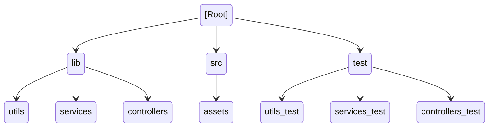
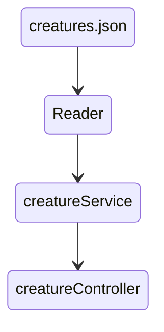

# Hackita project
El presente proyecto fue concebido para la participación en el hackaton HACK THE OCEAN de [LaunchX](https://www.instagram.com/innovaccionvirtual/?hl=en).

Nuestra tripulación consiste en estudiantes de back end NodeJs:

* [David Ramirez](https://github.com/DavidRamirez5)
* [Ubaldo Melchor](https://github.com/UbaldoFMelchor)
* [Fernando Morales](https://github.com/FernandoMoralesH)
* [Victor Saucedo](https://github.com/victorsaucedom)
* [Arturo Mendoza](https://github.com/ArturoMendozaA)

Tabla de Contenidos
1. [Introducción](#id1)
2. [Planteamiento del problema](#id2)
3. [Maquetación y propuestas de Wireframe](#id3)
4. [front end](#id4)
5. [Estructura de directorios](#id5)
6. [Flujo del programa](#id6)

## Introducción <a name="id1"></a>
Se nos presentó el desafío de crear un proyecto fullstack encaminado a resolver problemas ambientales, específicamente enfocados a los oceanos mediante la aplicación de las habilidades adquiridas durante la duración de curso de LaunchX.

Las herramientas que decidimos utilizar para la realización de nuestro proyecto fueron:

* Github
* NodeJs
* jQuery
* HTML
* CSS

## Planteamiento del problema <a name="id2"></a>

Entre los ejes para la búsqueda de una solución se nos presentaron:

* Especies en peligro de extensión.
* Contaminación (acidificación, derrames petroleros, etcétera).
* Cuidado y preservación de especies marinas.
* Sobrepesca

Decidímos buscar una forma de concientizar y facilitar la búsqueda de informacíon sobre las especies marinas que habitan en México.

El tema elegido fue: "Especies en Peligro de Extinción". Si bien el tema es algo muy sonado, es importante seguir informando a la sociedad acerca de las causas y posibles acciones para evitar que las especies sigan extingueindose puesto que todas ellas forman parte de los ecosistemas, las cuales tienen beneficios para el medio ambiente.

Acordamos que la mejor forma de hacerlo sería mediante el desarrollo de un sitio web y una API para poder consultar la información y presentarla de una forma atractiva y fácil de utilizar


Comenzamos utilizando Miro para comenzar a organizarnos de la siguiente manera


## Maquetación y propuestas de Wireframe<a name="id3"></a>


## Front end <a name="id4"></a>
Front End: El proyecto fue realizado en archivo html con apoyo de CSS Y Javascript (jQuery). °HTML - Se realiza el esqueleto que sera la estructura de la pagina Web" °CSS - Se aplican el estilo que dara forma al esqueleto dicha pagina Web °Javascript - Se utiliza para dar funcioalidad a la pagina.


Vista del sitio Web


## Estructura de directorios <a name="id5"></a>

En nuestra carpeta ```lib``` realizamos la separación de responsbilidades de la siguiente forma:
En la carpeta  Utils tenemos ```Reader.js``` para leer y transformar el archivo ```creatures.json``` en un objeto

En la carpeta ```services```tenemos el archivo ```creatureService``` para filtrar el objeto por nombres

Finalmente la carpeta ```controllers``` contiene el archivo ```creatureController``` con un método que nos permite obtener la información de una especie por nombre y otro que nos regresa todos los objetos

En la carpeta ```test``` tenemos las pruebas de unidad que corresponden a las carpetas que comparten el respectivo nombre del directorio ```lib``` 


## Flujo del programa <a name="id6"></a>




